# Planning Balancer (AssesmentAGIT)

**Candidate Token:** `VEH-Arief_Achmadi`  
**Track:** Full-stack

## Prerequisites / Runtime Versions
- **.NET SDK:** 10.0 (or matching runtime)
- **Database:** PostgreSQL (Ensure you have a local instance running)

## How to Run the Application

1. **Configure Database Connection**
   Open `AssesmentAGIT.Api/appsettings.Development.json` and ensure the `DefaultConnection` string matches your local PostgreSQL credentials. Make sure to create new database on pgadmin or any other postgres tool

2. **Run Database Migrations**
   Open a terminal in the root folder and run:
   ```bash
   cd AssesmentAGIT.Api
   dotnet ef database update --project ../AssesmentAGIT.Infrastructure/AssesmentAGIT.Infrastructure.csproj
   ```

3. **Start the API & Web Server**
   ```bash
   dotnet run
   ```
   The application will start. Open the printed localhost URL (e.g., `http://localhost:5000` or `https://localhost:5001`) in your browser to view the Minimal UI.

4. **Run Automated Tests**
   Open a terminal in the root folder and run:
   ```bash
   dotnet test
   ```
   This will run all 16 tests, covering the unit tests for the balancing logic and the integration tests for the API.

## Test Plan & Quality Requirements

# 10 Test Cases Guide
**Project:** AssesmentAGIT  
**Base URL:** `http://localhost:5000` (adjust to your actual port)  
**Tool:** Swagger UI at `/openapi/v1`

> **Before you start**
> 1. PostgreSQL is running and `appsettings.Development.json` has the correct connection string.
> 2. Run migrations: `dotnet ef database update` inside `AssesmentAGIT.Api/`
> 3. Start the API: `dotnet run` inside `AssesmentAGIT.Api/`
> 4. Open API Docs at `http://{localhost}/swagger` you should see the Swagger page.

---

## Unit Tests (PlanningBalancer Logic)
These tests verify the **core balancing algorithm** only. You can test these via the `POST /api/planning` endpoint, the API internally calls `PlanningBalancer.Balance()` on every submission. The Source of test logic can be found on `AssesmentAGIT.Test` as the automated test already can be run from there with `dotnet.test`. Any mention of `Source:` refer to the each test method.

---

### TEST 1 Sample Case (the official example)
**Source:** `Balance_SampleCase_ReturnsExpectedOutput`  
**Goal:** Verify the exact example from the assessment brief produces the correct balanced output.

**Request**
```http
POST /api/planning
Content-Type: application/json
```
```json
{
  "requestCode": "MANUAL-TEST-01",
  "slots": [
    { "slotName": "Monday",    "quantity": 4 },
    { "slotName": "Tuesday",   "quantity": 5 },
    { "slotName": "Wednesday", "quantity": 1 },
    { "slotName": "Thursday",  "quantity": 7 },
    { "slotName": "Friday",    "quantity": 6 },
    { "slotName": "Saturday",  "quantity": 4 },
    { "slotName": "Sunday",    "quantity": 0 }
  ]
}
```
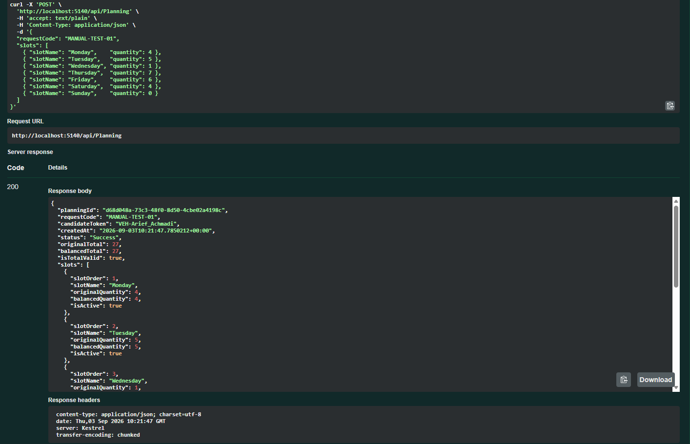

**Expected Response** `200 OK`

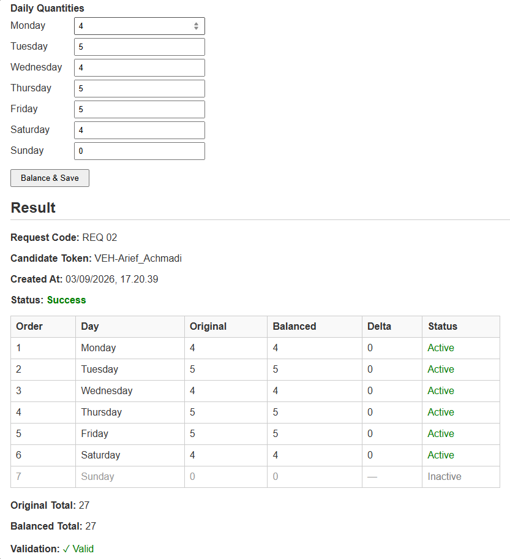

> **How it works:** Total of 6 active slots = 27. Base = floor(27/6) = 4. Remainder = 27 % 6 = 3. The 3 extras go to the 3 highest-original slots: Thursday(7) → 5, Friday(6) → 5, Tuesday(5) → 5.

---

### TEST 2 — Evenly Divisible (No Remainder)
**Source:** `Balance_EvenlyDivisibleTotal_DistributesEqually`  
**Goal:** When total divides exactly across all active slots, every slot gets the same value.

**Request**
```json
{
  "requestCode": "MANUAL-TEST-02",
  "slots": [
    { "slotName": "Day1", "quantity": 3 },
    { "slotName": "Day2", "quantity": 3 },
    { "slotName": "Day3", "quantity": 3 }
  ]
}
```
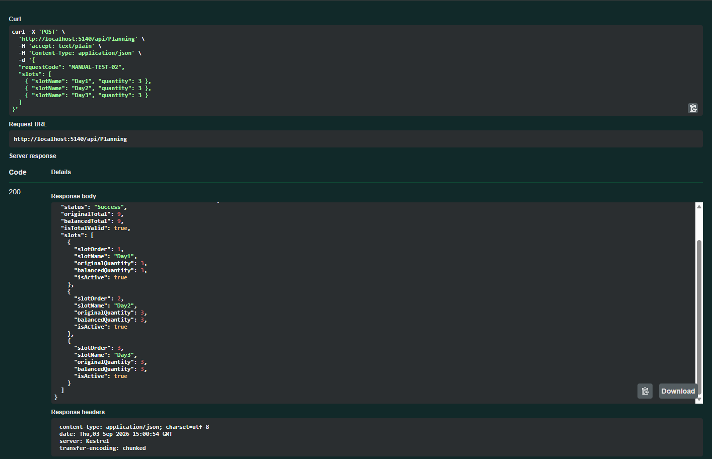

**Expected Response** `200 OK`

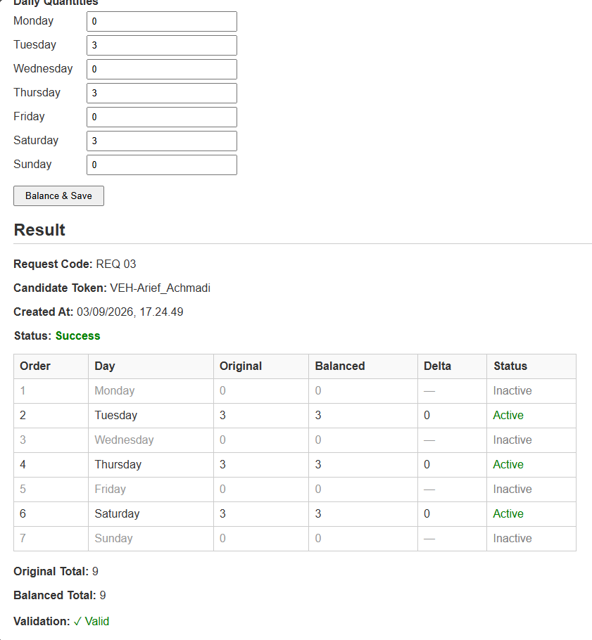

> No remainder, so every active slot gets exactly `floor(9/3) = 3`.

---

### TEST 3 — Remainder Goes to Highest Original
**Source:** `Balance_TotalWithRemainder_DistributesToHighestInitialValue`  
**Goal:** When there's a remainder, it is assigned first to the slot(s) with the highest original quantity.

**Request**
```json
{
  "requestCode": "MANUAL-TEST-03",
  "slots": [
    { "slotName": "Slot1", "quantity": 1 },
    { "slotName": "Slot2", "quantity": 1 },
    { "slotName": "Slot3", "quantity": 3 }
  ]
}
```

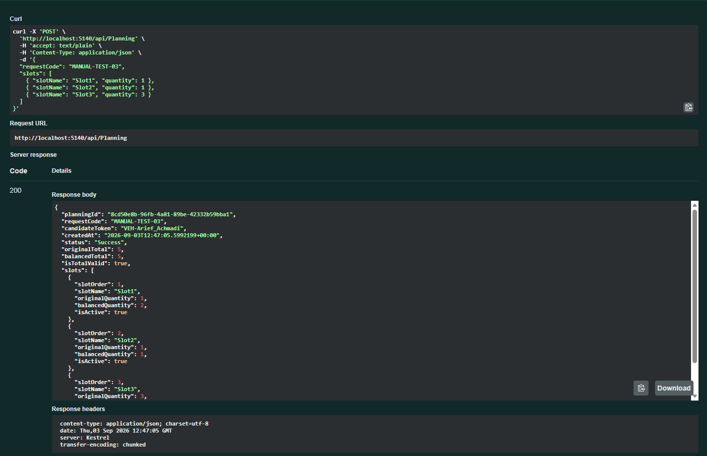

**Expected Response** `200 OK`

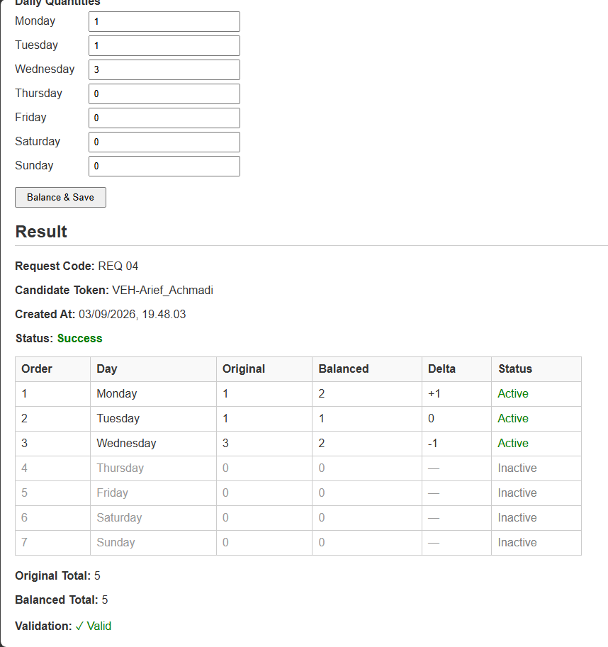

> Total = 5, active slots = 3. Base = floor(5/3) = 1. Remainder = 2. The highest original is Slot3(3) gets +1 → 2. Then Slot1 and Slot2 are tied at 1; earlier index wins → Slot1 gets +1 → 2.

---

### TEST 4 — All Zeros
**Source:** `Balance_AllZeros_ReturnsAllZeros`  
**Goal:** If every slot has quantity 0, the result must also be all zeros (no crash, no division by zero).

**Request**
```json
{
  "requestCode": "MANUAL-TEST-04",
  "slots": [
    { "slotName": "Day1", "quantity": 0 },
    { "slotName": "Day2", "quantity": 0 },
    { "slotName": "Day3", "quantity": 0 },
    { "slotName": "Day4", "quantity": 0 }
  ]
}
```

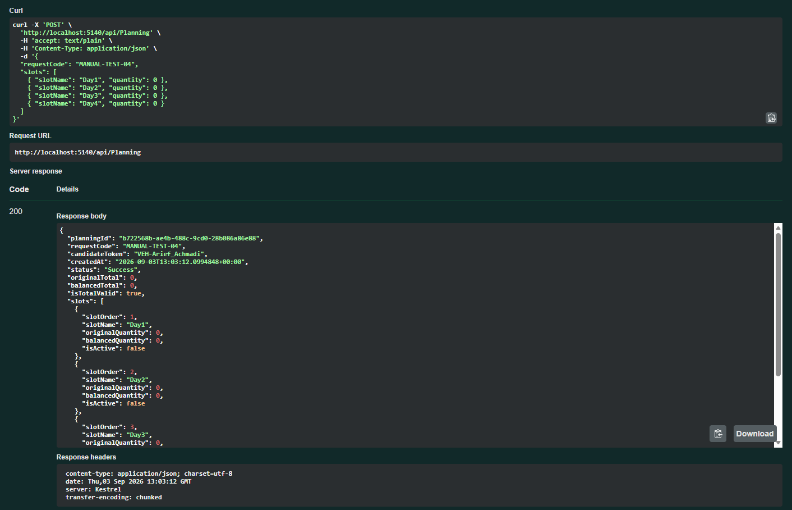

**Expected Response** `200 OK`

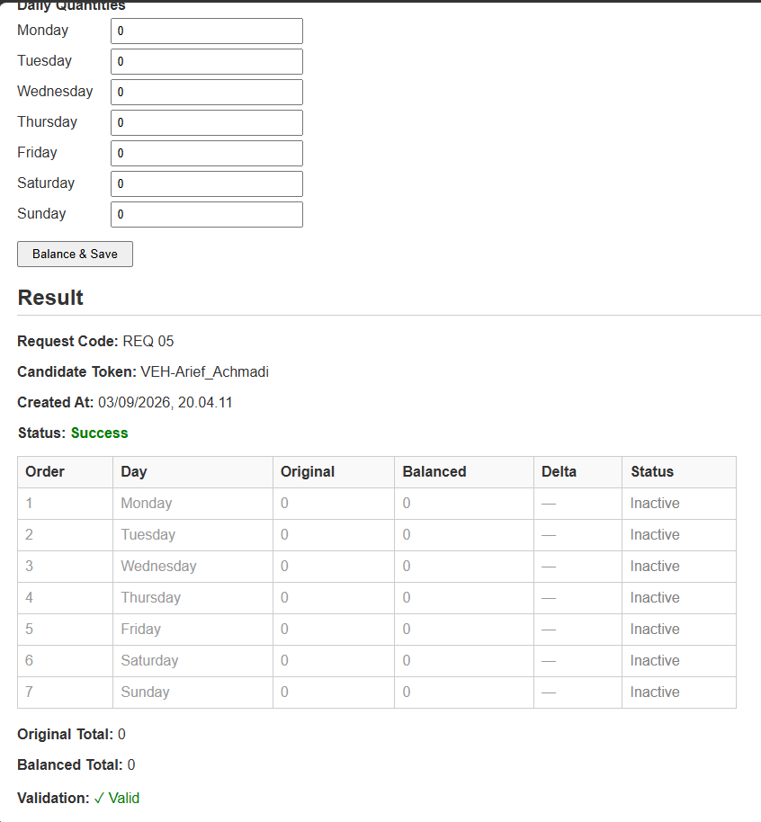

All `balancedQuantity` values = **0**, `isTotalValid` = **true** (0 == 0).

---

### TEST 5 — Single Active Slot
**Source:** `Balance_SingleActiveSlot_ReturnsUnchanged`  
**Goal:** If only one slot is active, its value is untouched.

**Request**
```json
{
  "requestCode": "MANUAL-TEST-05",
  "slots": [
    { "slotName": "Slot1", "quantity": 0  },
    { "slotName": "Slot2", "quantity": 10 },
    { "slotName": "Slot3", "quantity": 0  }
  ]
}
```

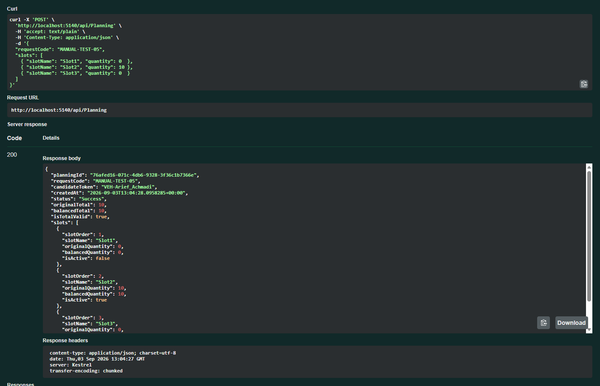

**Expected Response** `200 OK`

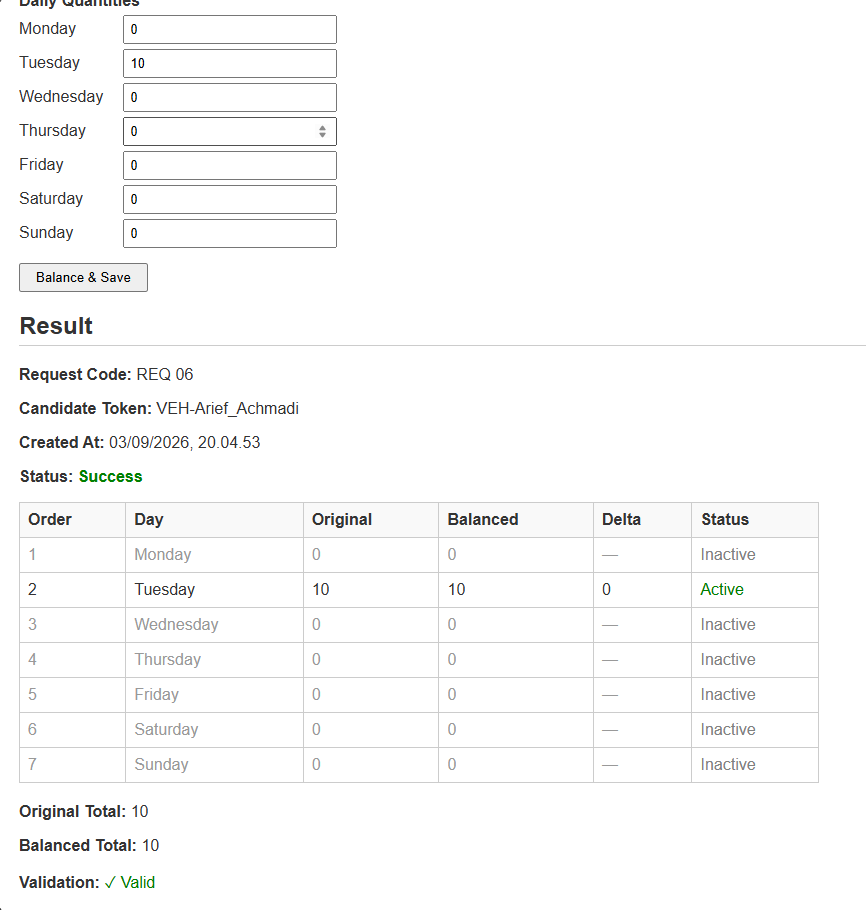

> Only one active slot — no balancing needed, value passes through unchanged.

---

### TEST 6 — Tie-Breaker (Same Original Value)
**Source:** `Balance_TieBreaker_PrioritizesEarlierSlot`  
**Goal:** When two slots have the same original quantity, the slot that appears **earlier** (lower index) gets the remainder first.

**Request**
```json
{
  "requestCode": "MANUAL-TEST-06",
  "slots": [
    { "slotName": "Slot1", "quantity": 6 },
    { "slotName": "Slot2", "quantity": 6 },
    { "slotName": "Slot3", "quantity": 4 }
  ]
}
```

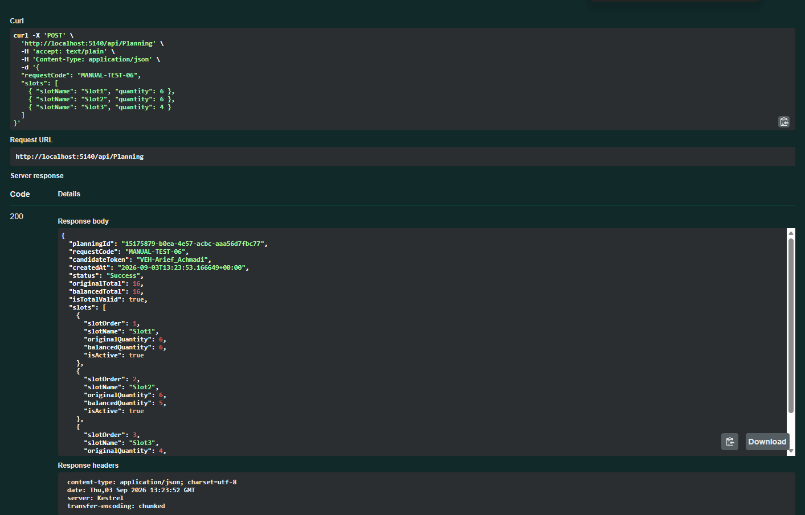

**Expected Response** `200 OK`

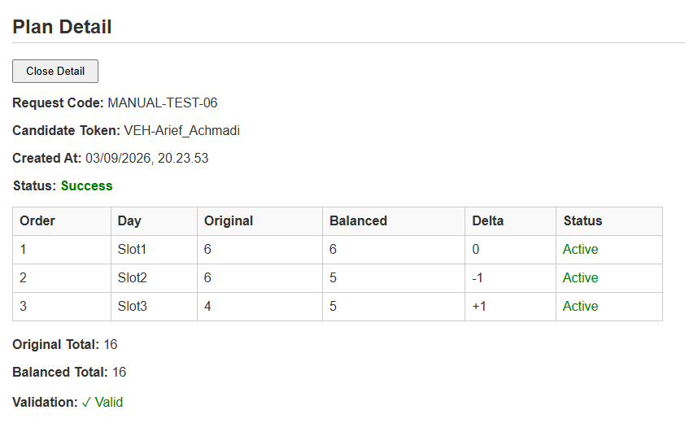

> Total = 16, active = 3. Base = floor(16/3) = 5. Remainder = 1. Slot1 and Slot2 are tied at 6; Slot1 comes first by index → gets the +1 → stays 6. Slot2 and Slot3 stay at 5.

---

### TEST 7 — Negative Quantity (Rejected)
**Source:** `Balance_InvalidInput_ThrowsArgumentException` (negative case)  
**Goal:** The API must reject requests containing negative quantities with `400 Bad Request`.

**Request**
```json
{
  "requestCode": "MANUAL-TEST-07",
  "slots": [
    { "slotName": "Monday",    "quantity": -1 },
    { "slotName": "Tuesday",   "quantity": 5  },
    { "slotName": "Wednesday", "quantity": 3  },
    { "slotName": "Thursday",  "quantity": 3  },
    { "slotName": "Friday",    "quantity": 3  },
    { "slotName": "Saturday",  "quantity": 3  },
    { "slotName": "Sunday",    "quantity": 0  }
  ]
}
```

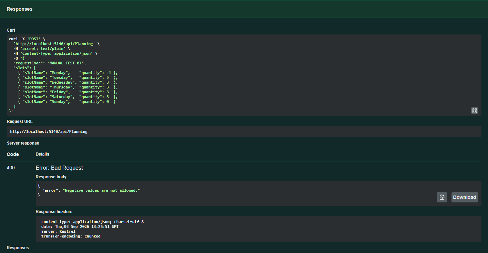

**Expected Response** `400 Bad Request`

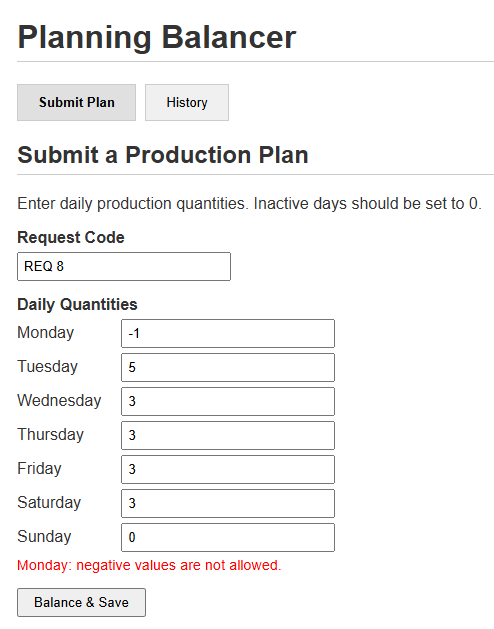

> ✅ Pass = status is 400. ❌ Fail = status is 200.

---

### TEST 8 — Empty / Missing Input (Rejected)
**Source:** `Balance_EmptyOrNullInput_ThrowsArgumentException`  
**Goal:** The controller rejects empty slots before even calling the algorithm.

**Request A — Empty slots array:**
```json
{
  "requestCode": "MANUAL-TEST-08A",
  "slots": []
}
```
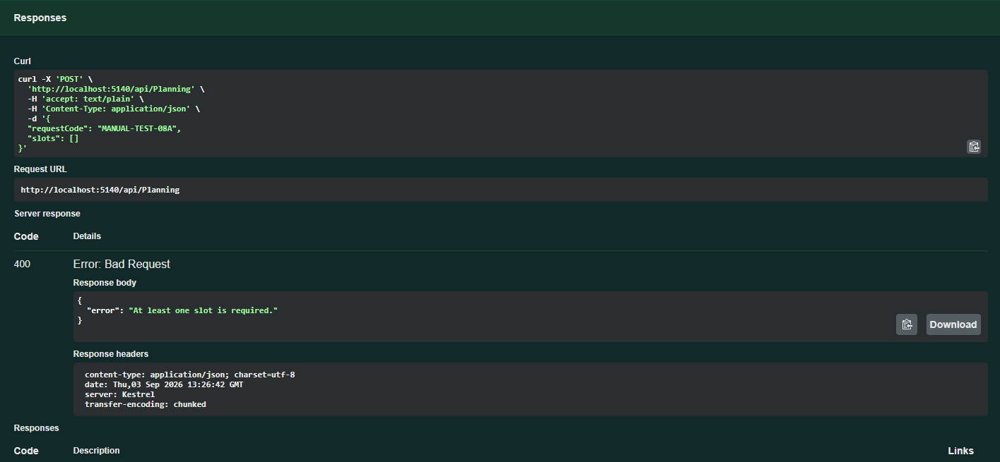

**Expected:** `400 Bad Request`

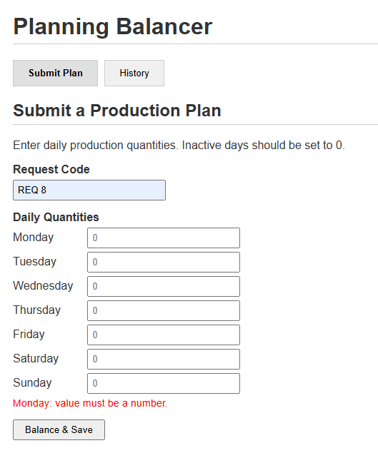

**Request B — Missing RequestCode:**
```json
{
  "requestCode": "",
  "slots": [
    { "slotName": "Day1", "quantity": 5 }
  ]
}
```

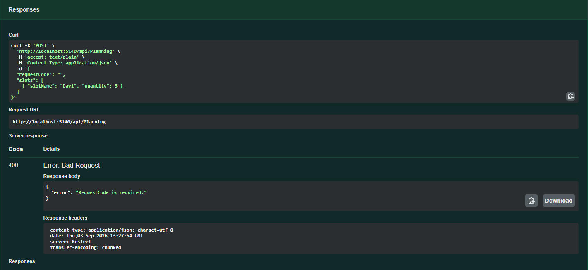

**Expected:** `400 Bad Request`

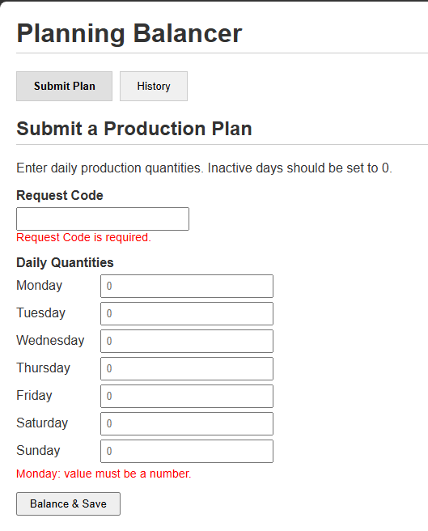

---

### TEST 9 — Extreme Large Values
**Source:** `Balance_ExtremeValues_BalancesCorrectly`  
**Goal:** The algorithm handles very large numbers without overflow or precision errors.

**Request**
```json
{
  "requestCode": "MANUAL-TEST-09",
  "slots": [
    { "slotName": "SlotA", "quantity": 1000000 },
    { "slotName": "SlotB", "quantity": 1000002 }
  ]
}
```

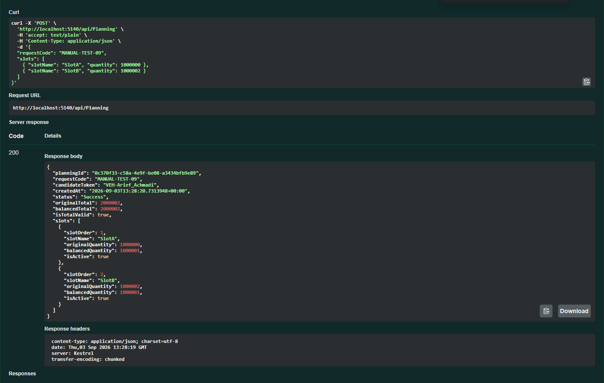

**Expected Response** `200 OK`

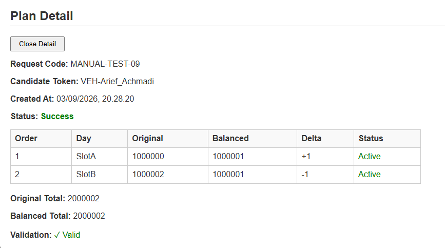

---

### TEST 10 — Idempotency (Same RequestCode Twice)
**Source:** `PostPlanning_SameRequestCodeTwice_DoesNotCreateDuplicate`  
**Goal:** Submitting the exact same `RequestCode` a second time must **not** create a new record. The API returns the original result silently.

**Step 1 — First submission**
```json
{
  "requestCode": "MANUAL-TEST-10",
  "slots": [
    { "slotName": "Monday",    "quantity": 4 },
    { "slotName": "Tuesday",   "quantity": 5 },
    { "slotName": "Wednesday", "quantity": 1 },
    { "slotName": "Thursday",  "quantity": 7 },
    { "slotName": "Friday",    "quantity": 6 },
    { "slotName": "Saturday",  "quantity": 4 },
    { "slotName": "Sunday",    "quantity": 0 }
  ]
}
```

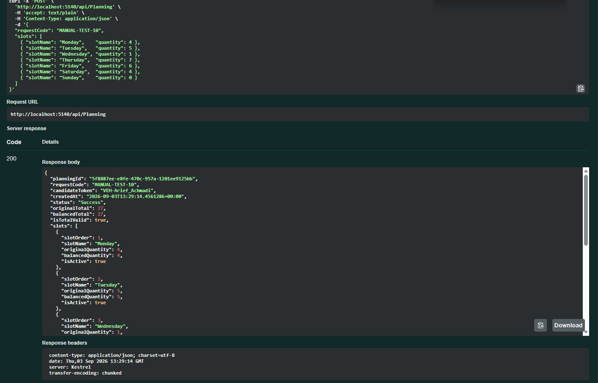

**Step 2 — Second submission, same RequestCode, completely different values**
```json
{
  "requestCode": "MANUAL-TEST-10",
  "slots": [
    { "slotName": "Monday",    "quantity": 99 },
    { "slotName": "Tuesday",   "quantity": 99 },
    { "slotName": "Wednesday", "quantity": 99 },
    { "slotName": "Thursday",  "quantity": 99 },
    { "slotName": "Friday",    "quantity": 99 },
    { "slotName": "Saturday",  "quantity": 99 },
    { "slotName": "Sunday",    "quantity": 99 }
  ]
}
```
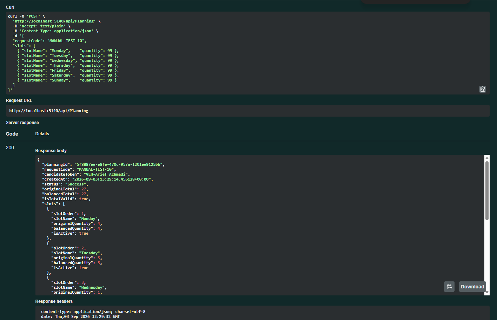

**Expected:** `200 OK`, and:

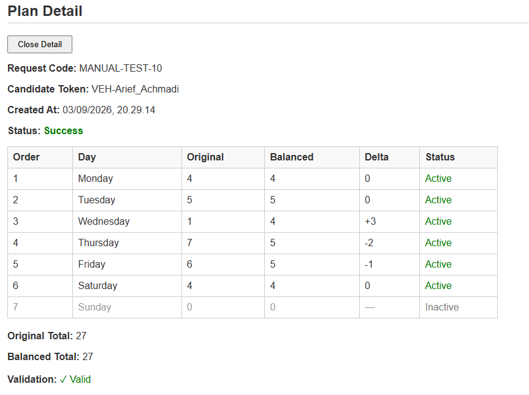

- `planningId` is **identical** to Step 1 ✅
- Balanced values are still `[4, 5, 4, 5, 5, 4, 0]` — **not** the new 99s ✅

**Optional DB verification:**
```sql
SELECT COUNT(*) FROM "Plannings" WHERE "RequestCode" = 'MANUAL-TEST-10';
```
> Must return `1` — only one row, even after two POSTs.

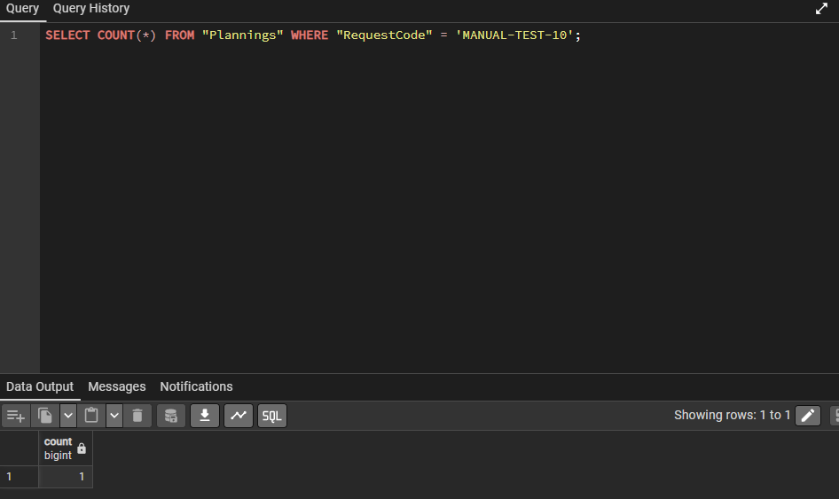

---

## Quick Reference

| # | Test | Method | Endpoint | Pass Condition |
|---|---|---|---|---|
| 1 | Sample Case | POST | `/api/planning` | Balanced = [4,5,4,5,5,4,0], total 27 |
| 2 | Even Division | POST | `/api/planning` | All slots = 3, total 9 |
| 3 | Remainder → Highest | POST | `/api/planning` | Result = [2,1,2], total 5 |
| 4 | All Zeros | POST | `/api/planning` | All balanced = 0, no error |
| 5 | Single Active Slot | POST | `/api/planning` | Slot2 = 10, others = 0 |
| 6 | Tie-Breaker | POST | `/api/planning` | Result = [6,5,5], total 16 |
| 7 | Negative Quantity | POST | `/api/planning` | `400 Bad Request` |
| 8 | Empty / No Code | POST | `/api/planning` | `400 Bad Request` |
| 9 | Extreme Values | POST | `/api/planning` | Both slots = 1,000,001 |
| 10 | Idempotency | POST ×2 | `/api/planning` | Same `planningId` both responses |

## Assumptions & Trade-offs

### Assumptions
- **Authentication & Token Strategy:** No JWT or session-based authentication is implemented at this stage. The `CandidateToken` is currently hard-coded in the service layer as a simple identity stamp (`VEH-Arief_Achmadi`). Going forward, this can be replaced with a proper user-based login flow and integrated with an OAuth provider (e.g., Google OAuth or Azure AD) if multi-user support is required.
- **Architecture Direction (Monolithic vs. Microservice):** The current implementation is a monolithic REST API structured in Clean Architecture layers. If a microservice architecture is desired in the future, the `Api` layer would be split into separate `Application` and `Presentation` services to support independent scalability and deployment of each concern.
- **Test Case Interpretation:** The balancing algorithm's edge cases — including the sample case, evenly divisible totals, totals with remainders, all-zero inputs, single active slot, tie-breaking, and invalid inputs — are each interpreted based on first-principles reasoning. No formal specification was provided for each scenario; the behavior was derived from the assessment description and documented in `PlanningBalancerTests.cs`.
- **RequestCode Uniqueness:** The `RequestCode` is currently supplied by the caller (user input) and enforced as unique via a database constraint and an idempotency check in the service layer. It is not auto-generated (e.g., as a GUID). This places the responsibility of meaningful code naming on the caller, which is intentional for traceability.

### Trade-offs
- **Architecture (Minimal UI):** To fulfill the "Minimal UI" requirement while reducing friction for the assessor, the frontend is built using static HTML/JS/CSS housed within the `wwwroot` folder of the API project. While a strict Clean Architecture might isolate the frontend into a separate Node.js project, co-hosting it simplifies the setup process (a single `dotnet run` command launches everything). 
- **Vanilla JavaScript:** Decided against using a frontend framework (like React or Vite) to keep the repository extremely lightweight, dependency-free, and easy to review line-by-line.
- **Integration Test Database:** Used EF Core's InMemory provider for integration tests instead of Testcontainers or a live PostgreSQL database. This ensures the tests run fast and reliably on any assessor's machine without requiring Docker, though it required conditional logic in the service layer to bypass transaction wrapping (since InMemory does not support DB transactions).

## Project Structure
- `AssesmentAGIT.Domain` - Core entities, DTOs, and the pure function `PlanningBalancer`.
- `AssesmentAGIT.Infrastructure` - Data access, `AppDbContext`, and EF Core mappings.
- `AssesmentAGIT.Api` - REST API controllers and static web assets (`wwwroot/`).
- `AssesmentAGIT.Tests` - xUnit tests covering business logic and API integration.
- `Case3.sql` - Standalone SQL script addressing Case 3 requirements.
